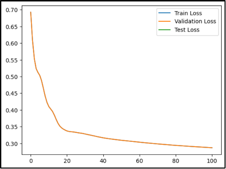

# CommunityDetection

## [Colab link](https://colab.research.google.com/drive/1Tmwrbvc10WNSuJtS-QBVGXuZ1K4jAMS6?usp=sharing)

**Community detection using GNN**

Authors:

**Meet Mehta: 300261159**

**Rakshita Mathur: 300215340**

[**1. Introduction 3**](#_v6pns81d1km4)

[**2. Dataset**](#_tpcncsmypcf3)[3](#_tpcncsmypcf3)

[I. Importing the Dataset 3](#_2gy9tot60fii)

[II. Preprocessing the Dataset 5](#_5rik06vc4dc3)

[III. Dataset Analysis 5](#_u069qllnxosd)

[IV. Data Encoding 7](#_9no4h7yd3j3b)

[A. One-Hot Encoding for Feature Representation 7](#_jztzihbtfezh)

[B. Creating Data Structures for Encoding 8](#_cgbyc2240k0f)

[V. Constructing a Graph 9](#_1qkhnesia6tp)

[A. Node Features and Labels 9](#_6h6vykunophk)

[B. Edge Data 10](#_epvceycwmbn5)

[C. Creating the Graph 10](#_vqezrw4ndgnw)

[D. Light Version of the Graph 10](#_p2bz3irryl0y)

[**3. Building models**](#_g5zne9f4x2g6)[11](#_g5zne9f4x2g6)

[I. GNN Model 11](#_nevyzl4nw4a9)

[A. Description of the GNN Model 11](#_unyxpwvkpzcf)

[B. Training the SocialGNN model 12](#_i7b2owitnd62)

[C. Results and Analysis 14](#_iymh5dq13rqz)

[II. Naive Bayes 14](#_9k3cxdgsprci)

[A. Description of the Naive Bayes Model 14](#_ykxs73yck1ny)

[B. Training the Naive Bayes Model 14](#_t3o2x97mk5q)

[C. Results and Analysis 15](#_j9knnvoo7wth)

[III. Logistic Regression 17](#_bxsidpmtdqk0)

[A. Description of the Logistic Regression Model 17](#_3x3tr0lq78db)

[B. Training of the Logistic Regression Model 18](#_sci1kybkwkr)

[C. Results and Analysis 18](#_dz3olntcphvp)

[**4. Comparison of the three models**](#_963detnzrmwe)[20](#_963detnzrmwe)

[I. Graph Neural Network (GNN) 20](#_lceu1qtrkh9c)

[II. Naive Bayes 21](#_3ghj4mt46pis)

[III. Logistic Regression 21](#_kobunvrplro4)

[**5. Conclusion 22**](#_orxa4h30qc0r)

[**6. Resources**](#_ag03zlgcd4zf)[22](#_ag03zlgcd4zf)

# Introduction

In the ever-evolving software development landscape, understanding the diverse communities and roles within the developer ecosystem is critical. GitHub, as a prominent platform for collaborative software development, provides extensive data that can shed light on the characteristics and preferences of its users. This project performs a social network analysis by utilizing a large dataset of GitHub developers, collected from the public API in June 2019.

Our primary objective is to tackle the challenge of binary node classification, where we aim to discern which community a particular GitHub user belongs to. Specifically, we focus on two distinct communities: web developers and machine learning developers. The dataset includes various 'features' for each node such as location, repositories starred, employer and email address.

To achieve this classification of these two communities, we leverage various Python libraries and tools, including numpy, pandas, matplotlib, networkx, and a deep learning framework Torch. Additionally, we utilize the capabilities of Torch Geometric, a library tailored for graph-based deep learning, to work with the graph structure.

Additionally, we construct and evaluate three different models: the Graph Neural Network, the Naive Bayes Model, and Logistic Regression. We thoroughly assess the results of each model by comparing their accuracy and delving into the reasons behind variations in accuracy across these three models.

This report comprehensively outlines the key stages of our project, spanning from data collection and preprocessing to model development, analysis, and comparison across the three models.

# Dataset

## Importing the Dataset

To initiate our deep learning project, the first essential step is to explore and load the dataset, allowing us to gain insights into its structure and characteristics. In this project, we work with a dataset sourced from GitHub, specifically, a social network of GitHub developers. The data includes information crucial for our binary node classification task.

The dataset is hosted on a public GitHub repository, and we have utilized Python libraries and tools to retrieve it. We ensured that we had access to the necessary data, including the feature data, edge data, and target data.

By executing the code shown in the notebook, we successfully retrieved the dataset from the specified GitHub URLs.

_Figure 2.1 Reading the dataset from the URL_

We can see the first and last five nodes of the Target Dataset in the table below to ensure that the dataset was correctly imported.

_Figure 2.2 Showing the first 5 items of the dataset_

_Figure 2.3 Showing the last 5 items of the dataset_

The following steps in our project include data preprocessing, model development, and thorough analysis as we progress toward our objectives.

## Preprocessing the Dataset

To prepare our GitHub dataset for deep learning models, several preprocessing steps are essential to enhance data quality and usability.

Feature Extraction:

In this phase, we extract and consolidate features from all 37,700 nodes in the dataset. A list named feats is employed to concatenate and store individual features. Simultaneously, we maintain another list, feat_counts, which records the length of features (indicating the number of features) associated with each node. This feature extraction process lays the foundation for subsequent data analysis and model development.

Feature Frequency Analysis:

To gain a deeper understanding of the dataset, we perform a feature frequency analysis. This analysis involves counting the frequency of each feature and storing the results in a dictionary called a counter. By examining the distribution of features, we can identify patterns and potentially influential features that will inform our model development.

## Dataset Analysis

We begin our analysis by identifying and exploring the top features in the dataset.

_Figure 2.4 Code snippet to determine the ten most frequently occurring features_

A data frame named _'top_features_df'_ is created to visualize the top features and their corresponding counts. The data frame is sorted to present the most frequently occurring features first.

_Figure 2.5 Code snippet to create a data frame to visualize the ten most frequently occurring features_

To provide a clear visual representation of the top features and their counts, we generate a heatmap. This heatmap showcases the frequency of these features using a color scale.

_Figure 2.6 Heatmap to show the ten most occurring features in the dataset_

## Data Encoding

The process of data encoding plays a pivotal role in preparing our GitHub dataset for effective utilization in machine learning and deep learning models. The primary goal of data encoding is to convert the raw dataset into a structured and standardized format, ensuring its compatibility with machine learning algorithms. Here is an overview of the data encoding process in our project:

_Figure 2.7 Code Snippet showing the encoding of the dataset_

### One-Hot Encoding for Feature Representation

Our dataset contains a diverse range of features such as location, repositories starred, employer, and email address associated with each node in the dataset. These features are heterogeneous and have different representations, making it essential to transform them into a unified format for analysis and model training. To achieve this, we employ one-hot encoding.

One-hot encoding is a technique where each feature is represented as a binary vector, where a value of 1 indicates the presence of the feature for the respective node, and 0 signifies its absence. This binary representation allows for a consistent and standardized format across all features and nodes.

### Creating Data Structures for Encoding

The data encoding process involves two critical data structures:

Data Encoded Dictionary

For each of the nodes in our dataset, we create a dictionary, _data_encoded_, which stores the one-hot encoded features. Each entry in the dictionary corresponds to a node, and its value is a list of binary values representing the presence or absence of each feature.

Sparse Feature Matrix

Given the potentially extensive list of features associated with each node and the large number of nodes in our dataset, it becomes necessary to create a more memory-efficient data structure. This is achieved through the creation of a sparse feature matrix. The sparse feature matrix condenses the encoded feature data into a format that is both memory-efficient and suitable for deep learning models.

By executing the code snippet below, we can create the sparse feature matrix of the first 100 nodes along with the first 550 features.

_Figure 2.8 Code Snippet showing how to plot the sparse feature matrix_

Since we cannot fit all 4005 features in the window, we are showing the first 550 features of the first 100 nodes by passing the value to the encoded function which will return a sparse matrix.

_Figure 2.9 Showing Sparse Feature Matrix of the first 550 features of the first 100 nodes_

##

## Constructing a Graph

One of the foundational steps in our project involves the construction of a graph that represents the GitHub developer network. This graph is essential for modeling the relationships between developers and for conducting various graph-based deep-learning tasks.

_Figure 2.10 Code snippet showing how to construct a graph_

### Node Features and Labels

We extract the node features from the input data, which represents various characteristics of each developer in our dataset. These features are converted into a tensor. Additionally, we extract the node labels from the '_target_df_' data frame, representing whether a developer is a Machine Learning Developer or a Web Developer.

### Edge Data

We prepare the edge data from the _'edges'_ variable, which indicates mutual follower relationships between developers. The edges are represented as tensors, and we create reverse edges to capture both directions of relationships.

### Creating the Graph

We create a PyTorch Geometric _'Data'_ object that encapsulates the graph. This object includes node features, labels, and edge information, which is crucial for subsequent graph-based deep-learning tasks.

### Light Version of the Graph

For efficiency and visualization purposes, we offer a "light" version of the graph. This version reduces the dimensionality of the graph and is suitable for visualization.

To visualize the constructed graph, we employ the _draw_graph_ function, which converts the PyTorch Geometric _'Data'_ object into a NetworkX graph and uses various visualization settings for an informative representation. The graph visualization helps us understand the relationships and community structures within the GitHub developer network.

_Figure 2.11 Connections between 55 different labeled nodes in the graph_

In the labeled graph above, read nodes represent Web Developers whereas grey nodes represent Machine Learning Developers. By constructing this graph, we can now easily analyze how different nodes are connected within the graph. The graph also reveals that the dataset is heavily biased towards Web Developers.

#

# Building models

## GNN Model

### Description of the GNN Model

Graph Neural Networks (GNNs) are a class of deep learning models designed for analyzing graph-structured data, and among them, Graph Convolutional Networks (GCNs) have emerged as a powerful and widely used subclass. These models find extensive applications in various domains, including social network analysis, recommendation systems, and bioinformatics, owing to their capability to effectively capture and model complex relationships within graph data.

In a graph, nodes represent entities, and edges represent connections or relationships. GCNs employ a message-passing mechanism, iteratively propagating and aggregating information from neighboring nodes. This process occurs over multiple layers, enabling GCNs to capture intricate, multi-hop relationships within the graph. This versatility allows GCNs to excel in various tasks, such as node classification, where the final layer's features enable predictions or classifications for each node. GCNs are an essential tool in graph-based machine learning and deep learning, making them valuable for understanding and harnessing the structure of diverse data in a connected world.

_Figure 3.1 Code snippet showing the SocialGNN model_

In the context of implementing GCNs, the provided code defines a neural network module called `_SocialGNN_`. This module is designed to work with graph data and uses the GCN architecture. It consists of two GCN layers, _`self.conv1`_ and _`self.conv2_`. The first layer, _`self.conv1`_, takes the input node features and performs message-passing operations using the edge index information. It produces an intermediate representation with _'f'_ output features and introduces non-linearity through the ReLU activation function. The second layer, _`self.conv2`\_, further refines the features and reduces them to just two dimensions.

To apply this model, the code includes a _`forward`_ method. It first extracts node features and edge connectivity information from the input data and proceeds to apply the two GCN layers iteratively. The result is the processed node features, representing the graph's structure and attribute-related information. This architecture is particularly well-suited for graph-related tasks where understanding and predicting relationships and properties within a graph is essential, and it can be adapted for a wide range of applications.

### Training the SocialGNN model

The _`train_social`_ function is a complete training framework for Graph Neural Network (GNN) models on graph-structured data. It sets up and optimizes the model with an Adam optimizer and a learning rate scheduler, monitoring training and evaluation metrics. Within a defined number of epochs, it iteratively updates the model, records loss and accuracy metrics, and dynamically adjusts the learning rate. This function provides a holistic view of the model's performance across training, validation, and test data, ensuring efficient model development and assessment.

During training, the _`train_social`_ function tracks and records critical training metrics, such as loss and accuracy, on different datasets. It evaluates and updates the model, selects the best-performing one, and visualizes the training progress through informative plots. This functionality simplifies the training process for GNN models, making it a valuable tool for tasks like node classification or graph-based learning where model evaluation and training dynamics are of utmost importance.

_Figure 3.2 Code snippet showing the train_social function_

The `_masked\_loss`\_ function calculates a specialized loss for graph-based tasks. It employs a binary mask to assign different weights to data points, focusing on the relevant portions of the graph. This weighted loss measures how well the model's predictions match the ground truth labels, emphasizing data points specified by the mask. It's a vital tool for ensuring the model's attention is directed to the graph elements that matter most in applications where not all nodes or edges are equally significant.

_Figure 3.3 Code snippet showing the masked_loss function._

The _`masked_accuracy`_ function is a valuable tool for assessing how well our model is performing on important tasks within our data. It employs a mask to identify and emphasize specific data points, ensuring that accurate measurements prioritize the essential elements. By comparing the model's predictions to the true labels and delivering an accuracy score for the highlighted data, it quantifies the model's success in a way that is meaningful and relevant to our specific goals.

_Figure 3.4 Code snippet showing the masked_accuracy function_

### Results and Analysis

In our GNN training journey, we employed the SocialGNN model, a two-layer Graph Convolutional Network (GCN), to grasp the intricate social dynamics within our dataset. The training process spanned epochs, leveraging a learning rate scheduler to enhance convergence. We closely monitored two key metrics—Loss, indicating the model's ability to minimize prediction errors, and Accuracy, gauging its correctness in classifying data points.

The first set of results, observed at Epoch 50, provides insights into the model's evolving performance. The Train Loss and Accuracy metrics showcase how well the model is learning from the data. Simultaneously, the Validation and Test Accuracy metrics offer glimpses into its proficiency in making accurate predictions.

As we extended the training to Epoch 100, the second set of results unfolded, shedding light on the continued learning process. Adjustments in the learning rate and the number of epochs were made to fine-tune the model's performance. The dynamic trends in Loss and Accuracy, graphically represented, illustrate the evolving capabilities of our GNN.

Throughout this analysis, the learning rate schedule emerges as a critical factor in adapting the model's learning rate over time. This dynamic adjustment contributes to the optimization of the model's convergence, enhancing its ability to capture and understand the intricate social relationships encoded in the dataset. In summary, this comprehensive analysis and visual representation offer a detailed narrative of the GNN training process.

## Naive Bayes

### Description of the Naive Bayes Model

In an alternate way, we used a Naive Bayes classifier, specifically the Gaussian Naive Bayes (GaussianNB). The Naive Bayes algorithm is a probabilistic classification algorithm based on Bayes' theorem. The "Gaussian" variant assumes that the features follow a Gaussian distribution. It is particularly suitable for continuous data.

### Training the Naive Bayes Model

The training of the Naive Bayes model occurs within a 4-fold cross-validation loop. The dataset is split into four subsets, and the model is trained and evaluated iteratively. The training process involves the following steps:

- The feature matrix (_`X_encoded`_) is transposed to ensure that each row corresponds to a feature, and each column corresponds to an observation.

- The target variable (_`y`_) is extracted from the original dataset.

- The dataset is split into training and testing sets using 4-fold cross-validation _(`KFold`)._

- For each fold, a Gaussian Naive Bayes classifier is instantiated _(`naive_bayes_classifier = GaussianNB()`)_ and trained using the training data _(`X_train, y_train`)_.

- Predictions are made on the test data _(`X_test`)_, and accuracy is calculated using _`accuracy_score_`.

- The confusion matrix is also computed for each fold.

_Figure 3.5 Code snippet showing the Naive Bayes model_

### Results and Analysis

The results are printed for each iteration of the cross-validation, including the accuracy of the model on the test data for each fold. After all iterations are complete, the average accuracy is calculated and printed.

_Figure 3.6 Showing the accuracy in every iteration and average accuracy_

Furthermore, the average confusion matrix is computed and displayed as a heatmap. The confusion matrix provides insights into the model's performance by showing the number of true positives, true negatives, false positives, and false negatives. The heatmap visualization is used to make it more interpretable.

_Figure 3.7 Showing the confusion matrix for the Test Data_

For visualizing how well our Naive Bayes model handled classifying "Web" and "ML" labels. The blue bars show the actual counts in our test data, while the green bars display our model's predictions. It's like comparing player stats – we can quickly see where our model did well and where it might have stumbled. Titled "Actual Labels VS Predicted Labels - Naive Bayes," this visual snapshot adds an extra layer to our analysis, making it easy to understand the real-world impact of our model's performance.

_Figure 3.8 Showing the Actual Labels VS Predicted Labels_

The final output includes the average accuracy of the Naive Bayes model which comes out to 44.45% and a visual representation of the average confusion matrix. This information is valuable for assessing the overall performance and behavior of the model across different folds of the dataset.

## Logistic Regression

### Description of the Logistic Regression Model

This logistic regression model is designed for binary classification tasks and aims to predict the target variable based on the features in the dataset. The choice of parameters, such as L1 regularization and balanced class weights, suggests an attempt to handle potential imbalances in the dataset.

_Figure 3.9 Code snippet showing the logistic regression model_

The logistic regression model used in this code is configured with the following parameters:

- Maximum number of iterations: 1000 (_`max_iter=1000`_)

- Solver: 'liblinear' (`_solver='liblinear'_`)

- Regularization parameter: 0.1 (_`C=0.1`)_

- Class weights: 'balanced' (_`class_weight='balanced'`_)

- Penalty type: L1 regularization (_`penalty='l1'`_)

### Training of the Logistic Regression Model

The training of the logistic regression model involves 4-fold cross-validation using the KFold method with shuffling and a random seed for reproducibility. The training set is derived from the transposed feature matrix _(`transposed_df`)_, while the corresponding target variable _(`y`)_ is used for training. The model is trained using the logistic regression algorithm for each fold, and accuracy scores for each iteration are printed.

### Results and Analysis

The average accuracy of the logistic regression model across the 4 folds is calculated and printed. Additionally, the average confusion matrix is computed and displayed using a heatmap. The confusion matrix provides insights into the model's performance, showing the number of true positives, true negatives, false positives, and false negatives.

_Figure 3.10 Showing the accuracies of the logistic regression model_

_Figure 3.11 Showing the confusion matrix of the logistic regression model_

A bar chart is created to visualize the counts of actual and predicted labels, distinguishing between Web and ML (Machine Learning) classes. The chart includes counts for actual Web and ML labels as well as counts for predicted Web and ML labels. This visualization helps to assess how well the model is performing in classifying instances from both classes.

_Figure 3.12 Showing the Actual Labels vs. predicted Labels of the logistic regression model_

In summary, the logistic regression model is trained and evaluated using cross-validation, and the results are presented in terms of accuracy of 83.42% and confusion matrices, providing a comprehensive understanding of the model's performance on the given dataset.

# Comparison of the three models

In our project, we've applied three distinct machine learning models to address the binary node classification task in the GitHub developer network. These models include the Graph Neural Network (GNN), Naive Bayes, and Logistic Regression. Each model offers unique characteristics and approaches to the problem, and in this section, we evaluate and compare their performance.

## Graph Neural Network (GNN)

The Graph Neural Network, specifically the Social GNN, is a deep learning model tailored for graph-structured data. It leverages the power of message passing and graph convolution to capture intricate relationships among nodes in the GitHub developer network. After extensive training, the GNN produces the most accurate predictions among the three models. As listed above the average accuracy of the GNN model comes to be 87.82%. The average accuracy was recorded after modifying the learning rate and epoch values to 0.01 and 100 from 0.1 and 50 respectively.

## Naive Bayes

Naive Bayes is a classical probabilistic model commonly employed for text classification and various straightforward classification tasks. In our project, we applied the Naive Bayes model to the dataset after performing one-hot encoding of the features. The model's inherent simplicity offers advantages such as efficient training and swift predictions. However, it's crucial to note that this model demonstrated the lowest accuracy among all the models, achieving an accuracy of 44.45%.

The primary reason for the model's inability to provide accurate results lies in its limitations when it comes to capturing the complexity of our dataset. The dataset is characterized by 4005 unique features, and each node typically exhibits approximately 10 to 20 features. This results in a substantial number of _'null'_ values for the numerous unrepresented feature columns, contributing to the model's suboptimal performance.

Furthermore, our dataset exhibits a notable imbalance, primarily favoring Web Developers. This skew in class distribution further exacerbates the model's challenges in prediction. The imbalanced data distribution, coupled with the extensive feature set, makes it challenging for Naive Bayes to discern meaningful patterns within the dataset accurately.

To summarize, while Naive Bayes offers simplicity and efficiency, it struggles when confronted with datasets of significant complexity and imbalanced class distributions, as demonstrated in our project.

## Logistic Regression

The Logistic Regression (LR) model achieved a notable accuracy of 83.42%, indicating its effectiveness in predicting whether a user is a Web developer or a Machine Learning developer. The success of LR in this binary classification task can be attributed to its underlying assumptions and the characteristics of the dataset. Logistic Regression assumes a linear relationship between features and the log odds of the target variable, and if the relevant features exhibit a relatively simple linear pattern, LR can perform well.

The specified hyperparameters, including the use of balanced class weights, suggest that the LR model is well-configured to handle potential imbalances in the class distribution. This consideration is crucial in scenarios where one class may be more prevalent than the other, which is the case in the dataset that we have chosen. The 4-fold cross-validation adds robustness to the assessment, ensuring that the reported accuracy is not influenced by the specific data split. Furthermore, the model's simplicity, coupled with the appropriate handling of imbalanced data and careful configuration of hyperparameters, contributes to its high accuracy in this specific classification task.

In conclusion, the LR model's success suggests that, given the dataset's characteristics and the task at hand which is similar to binary classification, a linear model like Logistic Regression can provide a reliable and interpretable solution for predicting the user's association with Web development or machine learning.

# Conclusion

_Figure 5.1 Showing the accuracies of three model_

# Resources
